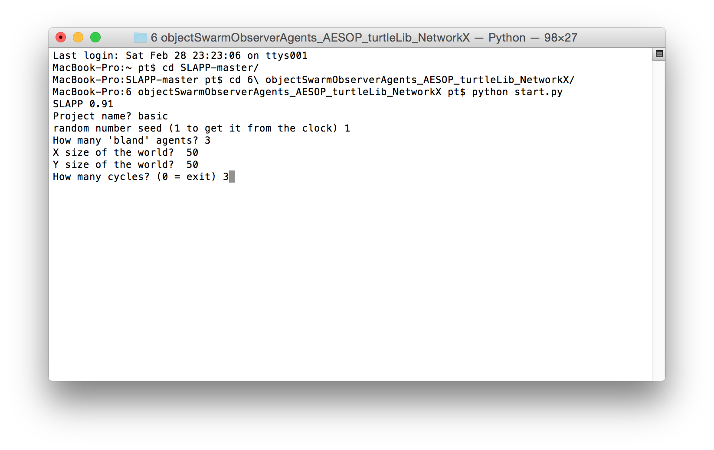
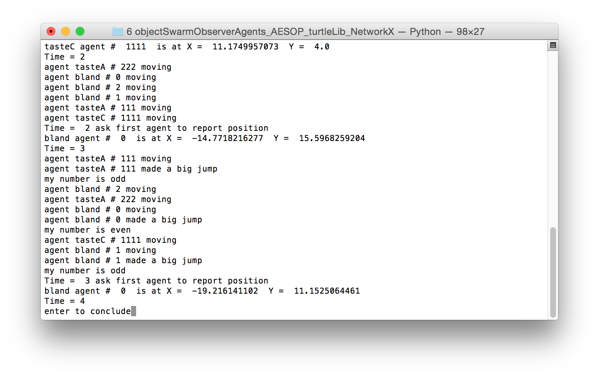
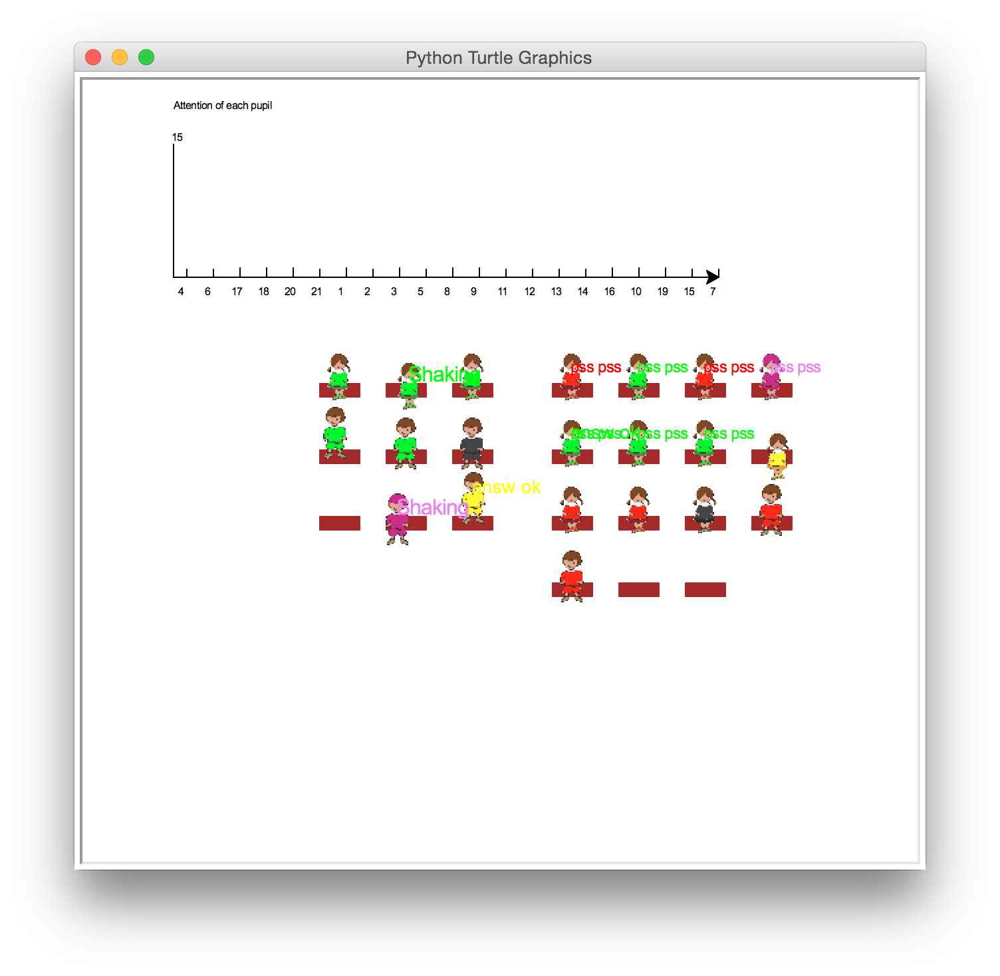
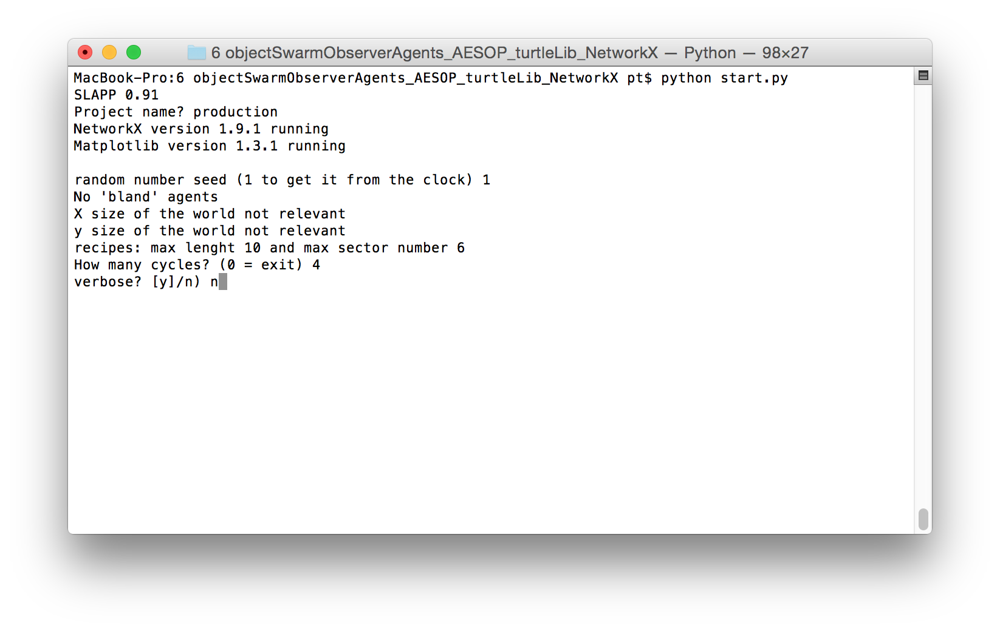
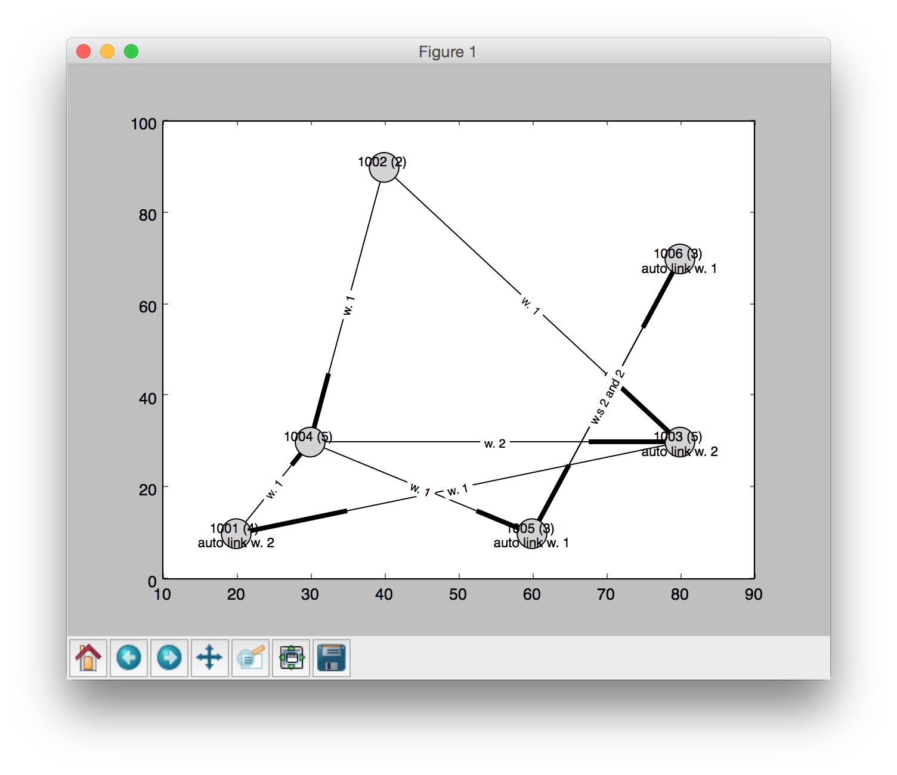

SLAPP 
=====

Swarm-Like Agent Protocol in Python

Here you have SLAPP v.0.95 (in the [SLAPP repository](http://eco83.econ.unito.it/terna/slapp_dep) you have related material and old versions).

A reference manual is coming (expected with version 1.0, in August 2015).

Five chapters of a new [book](http://www.palgrave.com/page/detail/agentbased-models-of-the-economy-/?K=9781137339805) are related to SLAPP.

---
SLAPP logo: credits to [Steve Rogers](https://www.linkedin.com/in/shrogers).

---

How to start: a quick introduction
====
To study the tutorial, read the content of the file "SLAPP tutorial.txt"

To start running the agent-based shell, read the content of the file "SLAPP shell.txt" and install the required libraries; then open a terminal, go into the SLAPP-master folder, then in the folder "6 objectSwarmObserverAgents_AESOP_turtleLib_NetworkX" (simply cd 6 and then tab) and

1 - launch the application "basic" as in the following window

The effect is (plain text output only):

or

2 - launch the application "school" as in the following window

The effect is (plain text output):

and as graphical output

or

3 - launch the application "production" as in the following window

The effect is (plain text output):

and as graphical output

