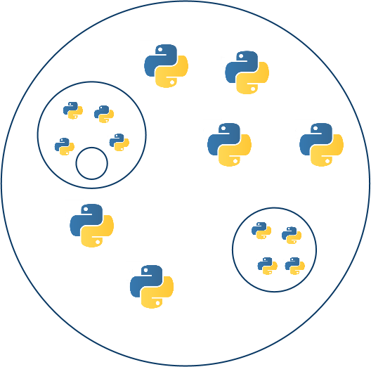
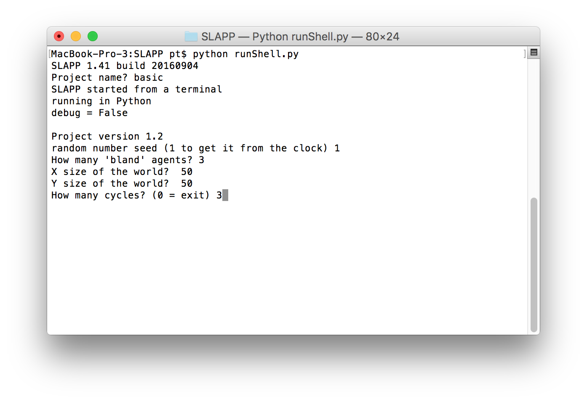
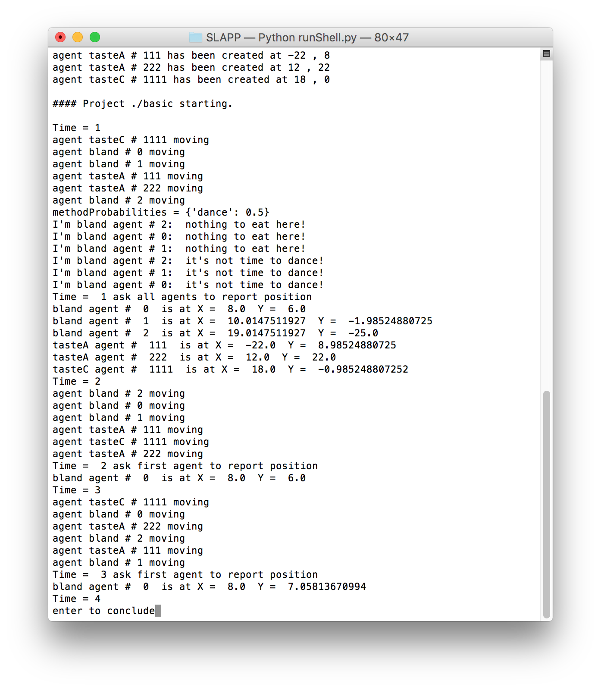
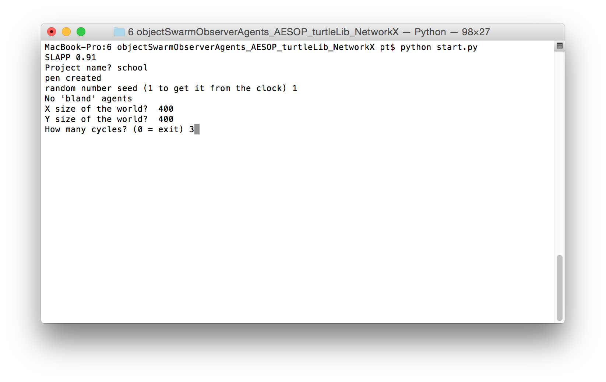
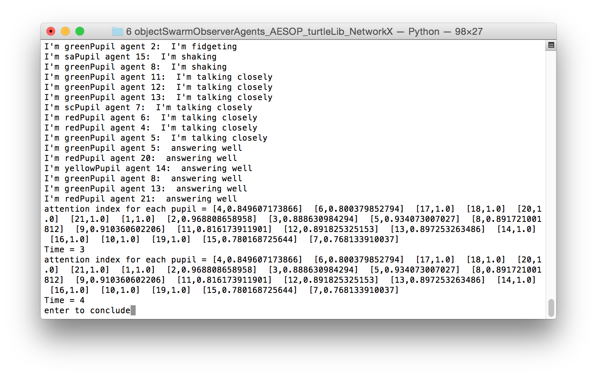
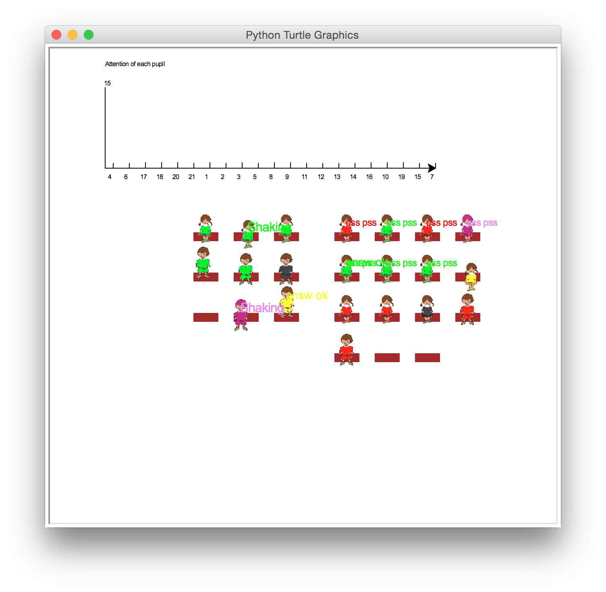
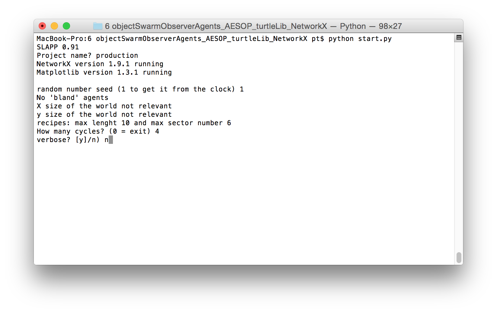
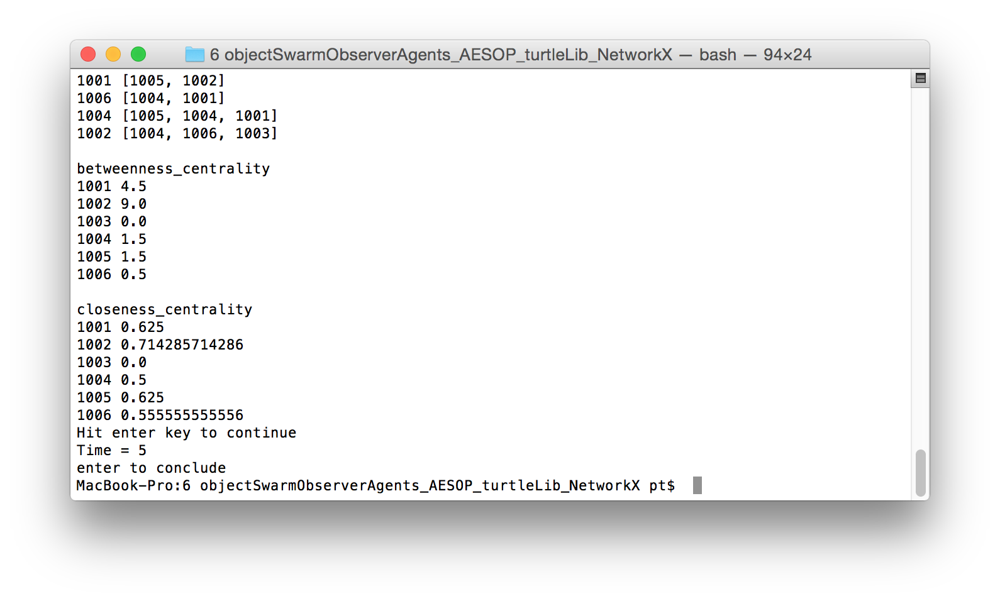
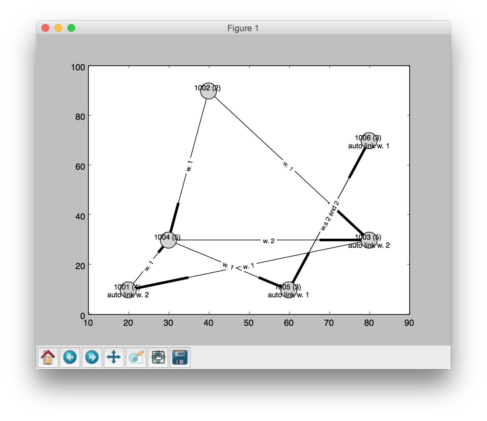

SLAPP 
=====

Swarm-Like Agent Protocol in Python

Here you have SLAPP **v.1.41 build 20160904** (in the [SLAPP repository](http://terna.to.it/slapp_dep/) you have related material and old versions).

We have here also a [**Reference Handbook**](https://github.com/terna/SLAPP/blob/v.1.41/SLAPP_Reference_Handbook.pdf) (it is still a draft and has to be improved).

Five chapters of the book of Boero, R., Morini, M., Sonnessa, M., and Terna, P.,  [Agent-based Models of the Economy - From Theories to Applications](http://www.palgrave.com/page/detail/agentbased-models-of-the-economy-/?K=9781137339805), are related to SLAPP.

---
SLAPP logo: credits to [Steve Rogers](https://www.linkedin.com/in/shrogers).

---

How to start: a quick introduction
====
Read the content of the file "SLAPP tutorial.txt" if you are interested in an introduction to Agent-based programming techniques in a general way; the tutorial shows the fundamental ideas of the[Swarm](http://www.swarm.org) project, which are the roots of the SLAPP construction; **NB**, to use SLAPP, it is not necessary to study that tutorial.

@@@To start running the agent-based shell, read the content of the file "SLAPP shell.txt" and install the required libraries (look at the Appendix A of the Reference Handbook in this folde); then open a terminal, go into the SLAPP main folder, and

1 - launch the application "basic" as in the following window:

The effect is (plain text output only):

or

2 - launch the application "school" as in the following window:

The effect is (plain text output):

and as graphical output:

or

3 - launch the application "production" as in the following window:

The effect is (plain text output):

and as graphical output:

Above you have different launching ways, using runShell.py (preferred) or
start.py in folder "6 objectSwarmObserverAgents_AESOP_turtleLib_NetworkX"
(also possible)

A good starting point about *running* SLAPP is the Reference Handbook,
section *How to run SLAPP*
